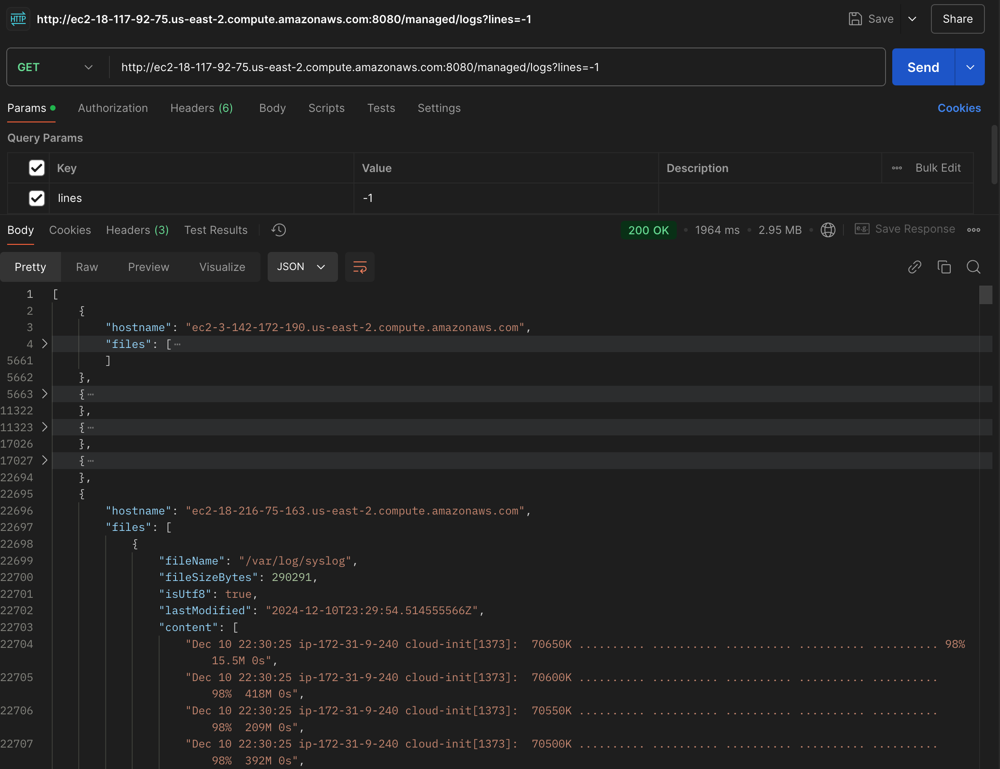

# loggerator-go

loggerator-go is an application written in Golang for reading and processing log files. It provides an HTTP API to retrieve log file contents, with support for filtering and handling various edge cases.

## Features

- Retrieve log file contents via an HTTP API
- Reads log files from a specified directory in most recent order
  - defaults to `/var/log`, may be overridden by setting the `LOG_DIR` environment variable
- Filter log files by extensions
- Handles non-readable files and empty files and directories

## Requirements

- Go 1.23 or later
- Make

## Dependencies
- `github.com/go-chi/chi/v5` - simple, fast, and idiomatic router
- `github.com/sirupsen/logrus` - structured, pluggable logging for Go
- `github.com/stretchr/testify` - testing toolkit

## Installation

1. Clone the repository:
    ```sh
    git clone https://github.com/leBruchette/loggerator-go.git
    cd loggerator-go
    ```

2. Install dependencies:
    ```sh
    go mod tidy
    ```

## Starting the Server
1. Run the server using the following command:
     ```sh
     make run-server
     ```

2. Access the API at `http://localhost:8080`, for example
    ```sh
    curl http://localhost:8080/logs
    ```

## API Endpoints
### GET `/logs`

Retrieve log file contents.

#### Query Parameters

- `lines` (optional): Number of lines to read from each log file. 
  - If not provided or invalid, defaults to 20. 
  - If set to -1, all lines are read.
- `search`: A search term to filter log lines. Only lines containing the search term will be returned.
- `excludedFileTypes` (optional): Comma-separated list of file extensions to exclude.

#### Example

```sh
  curl "http://localhost:8080/logs?lines=10&search=error&excludedFileTypes=.log,.txt"
```

### GET `/status`

Retrieve the server status.  This was meant for future (unimplemented) health checks from a main logging aggregation server

## BONUS ENDPOINT 
### GET `/managed/logs`
Retrieves logs from a list of servers.  Works the same as `/logs` but under-the-hood this request is delegated to a list of servers whic all contain the `/logs` endpoint


Still a WIP (no tests, server terraform isn't 100%); the endpoint is currently available at http://ec2-18-117-92-75.us-east-2.compute.amazonaws.com:8080/managed/logs
```sh
  curl http://ec2-18-117-92-75.us-east-2.compute.amazonaws.com:8080/managed/logs
```

This endpoint uses goroutines to concurrently fetch logs from the servers in the list.  The list of servers is currently hardcoded to five other ubuntu servers in AWS:
```go
servers := []string{
    "ec2-3-16-68-44.us-east-2.compute.amazonaws.com",
    "ec2-18-216-228-175.us-east-2.compute.amazonaws.com",
    "ec2-18-219-82-204.us-east-2.compute.amazonaws.com",
    "ec2-3-149-240-26.us-east-2.compute.amazonaws.com",
    "ec2-18-218-59-86.us-east-2.compute.amazonaws.com",
}
```
Results are in a similar structure to the `/logs` endpoint, but wrapped in an object containing `hostname`



The changes for this endpoint are in the `feat/log-aggregation` branch


## Testing
Run the tests using the following command:
```sh
  make test
```
To run the tests with coverage and generate a coverage report, use the following command:
```sh
  make test-coverage
```